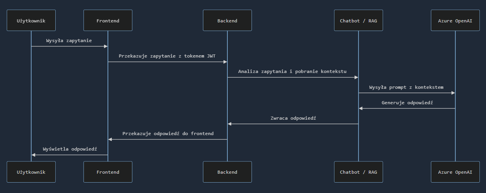
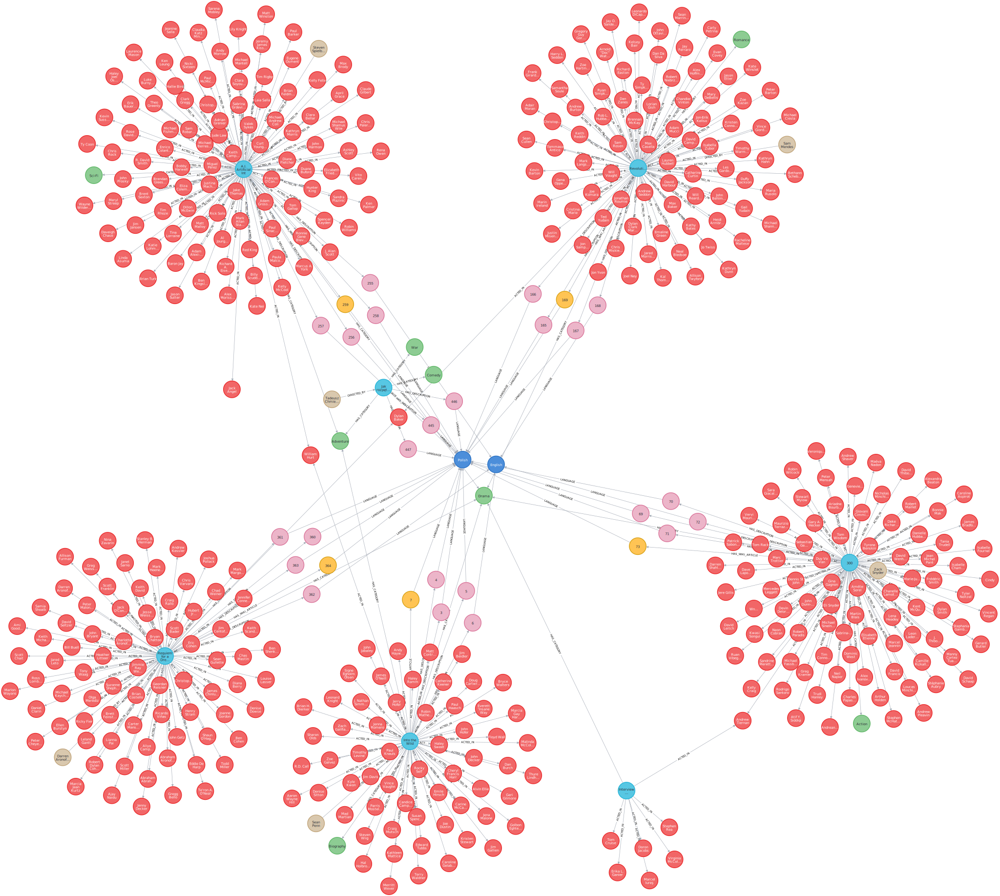
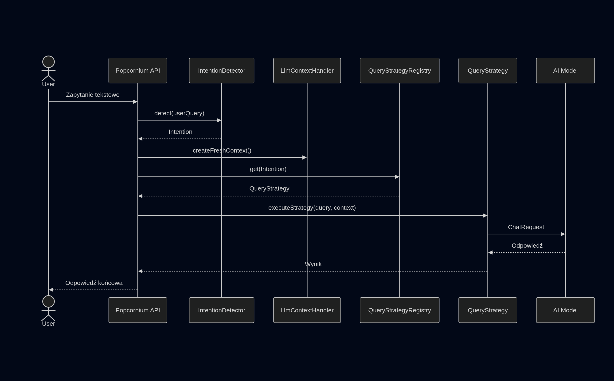
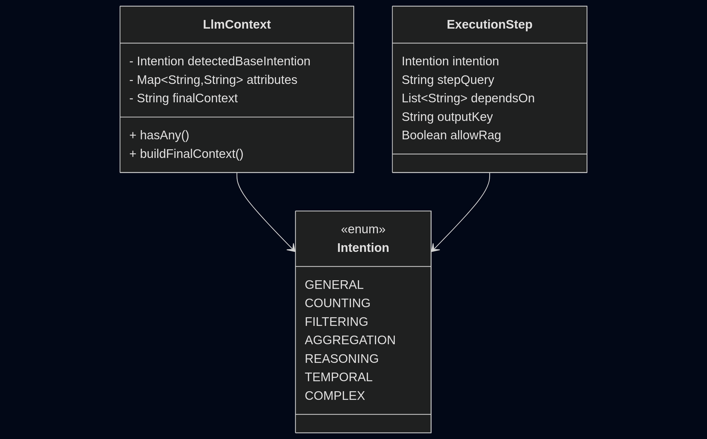
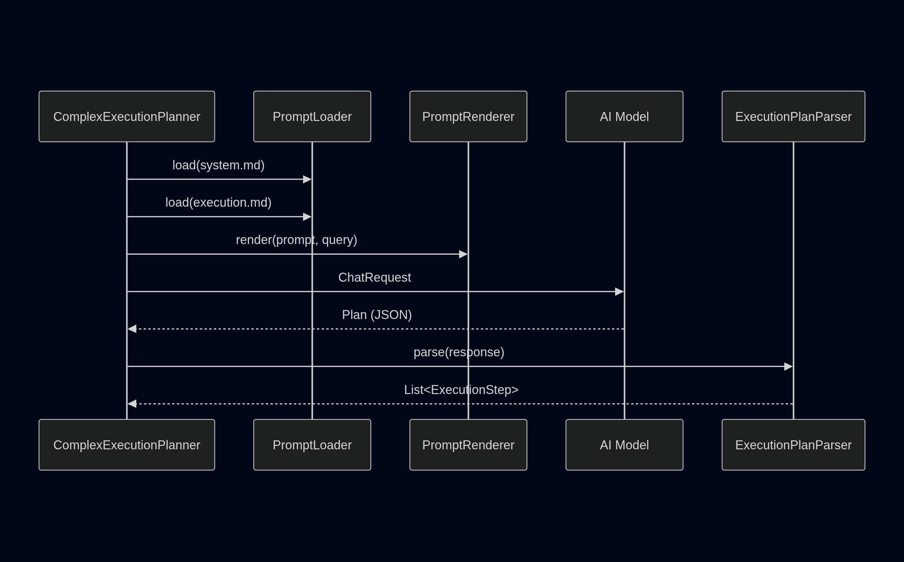
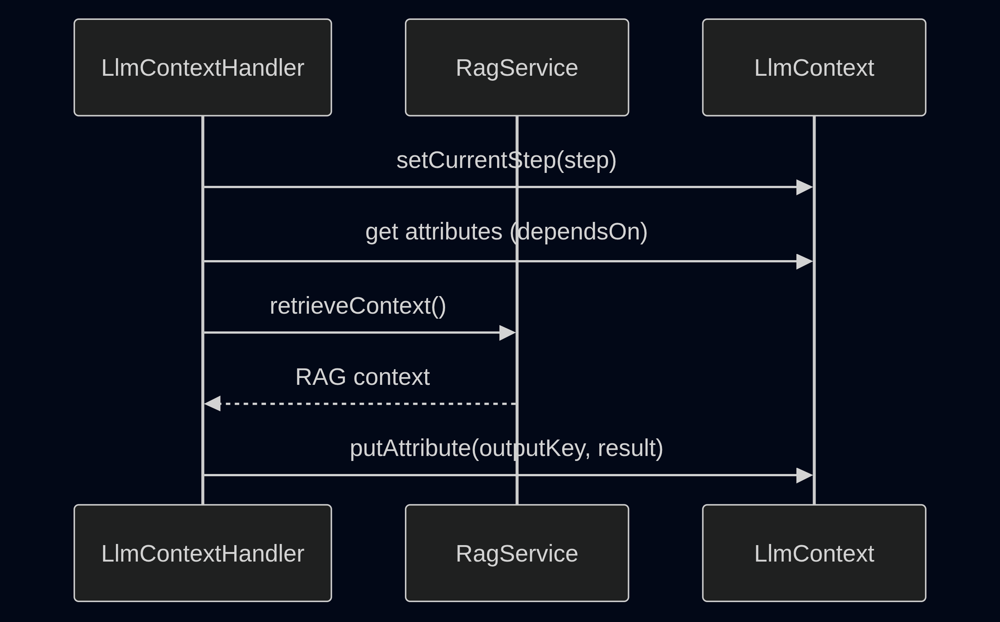
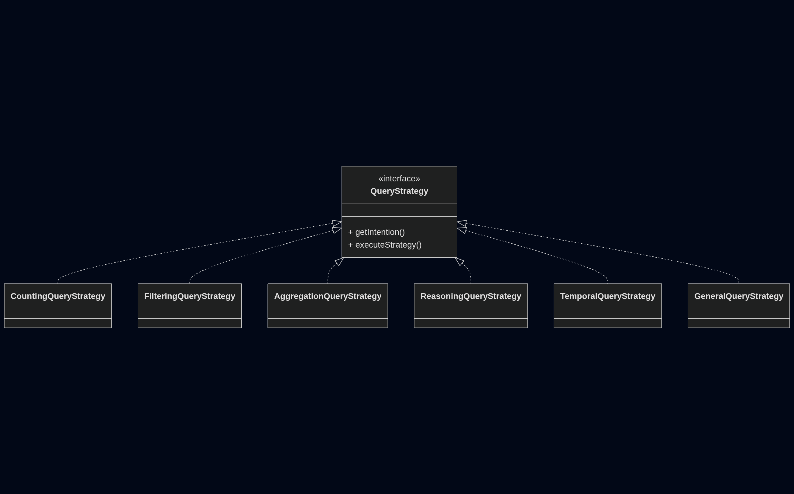
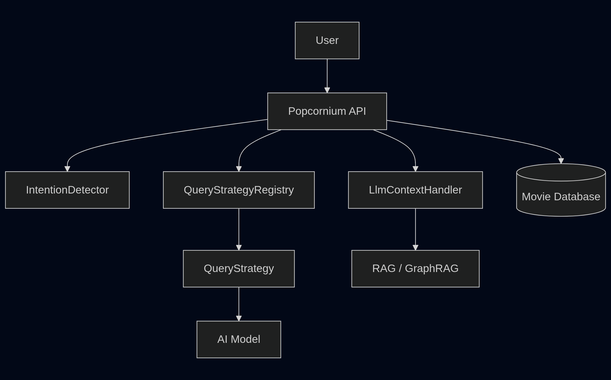

# 🍿Popcornium - wirtualny doradca filmowy

<br>

**Krzysztof Tokarski**  
**Marek Karpiński**  
**Bartosz Warda**

<br>

Warszawa  
Styczeń 2026

# 1. Wprowadzenie
## 1.1 Opis problemu i motywacja
Współczesne aplikacje filmowe oferują dostęp do bardzo dużych zbiorów danych, jednak interakcja z nimi najczęściej ogranicza się do statycznego przeglądania list, filtrowania wyników lub prostego wyszukiwania po nazwach. W praktyce użytkownik, który chce uzyskać odpowiedź na bardziej złożone pytanie. Na przykład dotyczące powiązań pomiędzy filmami, aktorami i reżyserami lub rekomendacji opartych na własnych preferencjach, zmuszony jest do samodzielnego analizowania wielu źródeł informacji.

Motywacją do stworzenia systemu Popcornium było zaprojektowanie aplikacji, która umożliwia eksplorację bazy filmowej w sposób bardziej naturalny i intuicyjny. Kluczowym założeniem projektu było wykorzystanie interfejsu konwersacyjnego, pozwalającego na zadawanie pytań w języku naturalnym oraz uzyskiwanie odpowiedzi opartych na rzeczywistych danych przechowywanych w systemie. Projekt stanowi również praktyczne porównanie dwóch podejść do wyszukiwania wiedzy w systemach RAG: wyszukiwania wektorowego oraz wyszukiwania grafowego (GraphRAG).
## 1.2 Wizja systemu Popcornium

Popcornium to aplikacja webowa łącząca funkcjonalności klasycznej aplikacji filmowej z inteligentnym chatbotem opartym o modele językowe. System umożliwia użytkownikowi przeglądanie bazy filmów wraz z grafikami, dostęp do szczegółowych informacji o wybranych produkcjach, takich jak obsada, reżyser czy opis fabuły, a także tworzenie własnych watchlist i ocenianie filmów za pomocą prostych reakcji (łapka w górę / łapka w dół).

Centralnym elementem aplikacji jest chatbot kontekstowy, który wykorzystuje techniki RAG oraz GraphRAG. Chatbot uwzględnia zarówno dane domenowe przechowywane w systemie, jak i kontekst użytkownika obejmujący historię rozmów, wystawione oceny oraz elementy watchlist. Dzięki temu możliwe jest generowanie odpowiedzi bardziej trafnych, spójnych oraz lepiej dopasowanych do preferencji konkretnego użytkownika.
## 1.3 Zastosowane technologie

Backend aplikacji został zrealizowany w języku Java 21 z wykorzystaniem frameworka Spring Boot w wersji 3.5.8, co zapewnia wysoką stabilność, modularność oraz łatwą integrację z zewnętrznymi usługami. Do obsługi bezpieczeństwa zastosowano Spring Security w konfiguracji stateless z mechanizmem JWT, co pozwala na bezpieczną identyfikację użytkowników bez konieczności utrzymywania sesji po stronie serwera.

Dane aplikacyjne przechowywane są w relacyjnej bazie PostgreSQL, rozszerzonej o wtyczkę PgVector, która umożliwia efektywne przechowywanie oraz porównywanie embeddingów wykorzystywanych w wyszukiwaniu wektorowym. Relacje pomiędzy filmami, aktorami i reżyserami odwzorowane są dodatkowo w bazie grafowej Neo4j, wykorzystywanej w mechanizmie GraphRAG.

Warstwa frontendowa została zaimplementowana w React.js z użyciem biblioteki Material UI, co umożliwia budowę nowoczesnego i responsywnego interfejsu użytkownika.

System integruje się z zewnętrznymi źródłami danych, takimi jak IMDb oraz Wikipedia, które dostarczają informacji filmowych i opisowych. Generowanie embeddingów oraz odpowiedzi modelu językowego realizowane jest przy użyciu usługi Azure OpenAI. Pliki multimedialne, w szczególności zdjęcia filmów i aktorów, przechowywane są w obiektowym systemie MinIO. Całość infrastruktury została skonteneryzowana z użyciem Docker oraz Docker Compose.
### Backend

- Java 21

- Spring Boot 3.5.8

- Spring Security (stateless, JWT)

- PostgreSQL + PgVector

- Neo4j

### Frontend

- React.js
- MaterialUI

### Integracje zewnętrzne

- IMDb – źródło danych filmowych

- Wikipedia – dodatkowe informacje opisowe

- Azure OpenAI – generowanie embeddingów oraz odpowiedzi LLM

- MinIO – przechowywanie zdjęć filmów i aktorów

### Infrastruktura

- Docker / Docker Compose - pełna konteneryzacja aplikacji i usług

# 2. Opis architektury systemu

Architektura systemu Popcornium została zaprojektowana w sposób modułowy, z wyraźnym podziałem odpowiedzialności pomiędzy komponentami odpowiedzialnymi za dane, wyszukiwanie wiedzy oraz interakcję z użytkownikiem.

## 2.1 Ogólny schemat architektury
<figure style="text-align: center;">
  
  <figcaption>
    Rysunek 2.1 schemat przepływu danych
  </figcaption>
</figure>

        

## 2.2 Źródła danych
System korzysta zarówno z danych zewnętrznych, jak i danych generowanych przez użytkowników. Informacje filmowe pozyskiwane są z serwisów IMDb oraz Wikipedia, natomiast obrazy filmów i aktorów przechowywane są w systemie MinIO. Dane użytkowników obejmują tworzone watchlisty, wystawiane oceny oraz historię konwersacji z chatbotem i są zapisywane w relacyjnej bazie danych.

## 2.3 Moduły systemu
### 2.3.1 Moduł integracji

Moduł odpowiedzialny za pobieranie i inicjalne ładowanie danych filmowych do relacyjnej bazy danych. Dane są mapowane na encje domenowe oraz zapisywane przy starcie aplikacji.

### 2.3.2 Warstwa danych

Relacyjna baza danych PostgreSQL pełni rolę głównego repozytorium danych aplikacyjnych. Przechowywane są w niej informacje filmowe prezentowane w interfejsie użytkownika, embeddingi wykorzystywane w wyszukiwaniu wektorowym oraz dane użytkowników, takie jak oceny i watchlisty. Uzupełnieniem tej warstwy jest baza grafowa Neo4j, która przechowuje relacje pomiędzy encjami domenowymi i umożliwia realizację zapytań grafowych w ramach GraphRAG.

### 2.3.3 Chatbot i warstwa RAG

Chatbot stanowi centralny komponent systemu. Odpowiada on za analizę intencji zapytania użytkownika, wybór odpowiedniej strategii wyszukiwania (Vector RAG lub GraphRAG), wzbogacanie promptu o kontekst użytkownika oraz komunikację z usługą Azure OpenAI w celu wygenerowania odpowiedzi.

### 2.3.4 Moduł bezpieczeństwa

Moduł bezpieczeństwa oparty o Spring Security zapewnia uwierzytelnianie i autoryzację użytkowników z wykorzystaniem tokenów JWT. Rozwiązanie to umożliwia bezpieczny dostęp do zasobów API oraz jednoznaczną identyfikację użytkownika w operacjach takich jak ocenianie filmów, zarządzanie watchlistami czy personalizacja odpowiedzi chatbota.

### 2.3.5 Frontend Layer

Warstwa frontendowa, zaimplementowana w React.js, umożliwia użytkownikom interakcję z systemem poprzez przeglądanie filmów, korzystanie z chatbota oraz zarządzanie własnymi danymi. Frontend komunikuje się z backendem wyłącznie poprzez zabezpieczone API.

# 3. Embeddings

System Popcornium wykorzystuje embeddingi jako kluczowy mechanizm reprezentacji wiedzy tekstowej w ramach podejścia Retrieval-Augmented Generation (RAG). Celem zastosowania embeddingów jest umożliwienie semantycznego wyszukiwania informacji o filmach, aktorach oraz powiązanych kontekstach w sposób niezależny od dokładnej treści zapytania użytkownika.

Embeddingi stanowią warstwę pośrednią pomiędzy klasyczną bazą danych a modelem językowym, umożliwiając efektywne dopasowanie zapytań użytkownika do najbardziej relewantnych fragmentów wiedzy.

## 3.1 Model danych

Proces generowania embeddingów opiera się na danych przechowywanych w relacyjnej bazie danych, która pełni rolę głównego repozytorium wiedzy o filmach. Centralną encją w tym modelu jest obiekt Movie, który agreguje informacje o filmie, takie jak metadane produkcyjne, obsada, opisy fabularne oraz powiązane artykuły z Wikipedii.

Dane te są reprezentowane przez zestaw encji domenowych, obejmujących m.in. aktorów, reżyserów, kategorie filmowe, opisy fabuły oraz artykuły encyklopedyczne. Dodatkowo system przechowuje informacje o interakcjach użytkownika z filmami, takie jak oceny czy elementy watchlisty. Wygenerowane embeddingi zapisywane są w dedykowanej encji Embedding, która przechowuje zarówno wektor osadzenia, jak i treść źródłową, na podstawie której został on wygenerowany.

Tak zaprojektowany model danych umożliwia elastyczne przetwarzanie informacji o filmach oraz łatwe rozszerzanie systemu o kolejne źródła wiedzy.


## 3.2 Proces generowania embeddingów

Proces generowania embeddingów realizowany jest przez dedykowany komponent EmbeddingService, odpowiedzialny za przekształcanie danych tekstowych w reprezentację wektorową. Proces ten wykonywany jest cyklicznie lub inicjalnie, po załadowaniu danych filmowych do bazy.

Na początku system pobiera wszystkie filmy wraz z pełnym zestawem powiązanych danych. Następnie informacje o każdym filmie są dzielone na logiczne fragmenty, które odpowiadają różnym aspektom wiedzy o filmie. Taki podział danych (chunking) pozwala na zachowanie spójności semantycznej poszczególnych fragmentów oraz zwiększa precyzję późniejszego wyszukiwania.

Fragmenty te obejmują m.in. podstawowe metadane filmu, informacje o obsadzie, opis fabuły oraz treści pochodzące z Wikipedii. Każdy z tych fragmentów przetwarzany jest niezależnie i przekazywany do integracji z usługą Azure OpenAI, gdzie generowany jest embedding przy użyciu dedykowanego modelu do osadzeń tekstowych.

Wygenerowane wektory są następnie walidowane pod kątem poprawności rozmiaru i zapisywane w bazie danych wraz z informacją o typie fragmentu oraz jego oryginalnej treści. Dzięki temu system zachowuje pełną kontrolę nad tym, jaki kontekst został użyty podczas późniejszego wyszukiwania.

## 3.3 Wykorzystanie embeddingów w wyszukiwaniu semantycznym

Embeddingi zapisane w bazie danych wykorzystywane są podczas obsługi zapytań użytkownika w ramach strategii Vector RAG. W momencie zadania pytania system generuje embedding dla zapytania użytkownika, a następnie porównuje go z embeddingami zapisanymi w bazie danych.

Na podstawie podobieństwa semantycznego wybierane są najbardziej relewantne fragmenty wiedzy, które następnie przekazywane są do modelu językowego jako kontekst wspomagający generowanie odpowiedzi. Takie podejście pozwala na uzyskanie odpowiedzi opartych na faktycznych danych znajdujących się w systemie, a nie wyłącznie na wiedzy ogólnej modelu językowego.

## 3.4 Wykorzystanie kontekstu użytkownika

Oprócz embeddingów system Popcornium uwzględnia również kontekst związany z aktywnością użytkownika. Informacje takie jak oceny filmów, tworzone watchlisty czy historia rozmów z czatem wykorzystywane są podczas budowania zapytania przekazywanego do modelu językowego.

Kontekst użytkownika pozwala na personalizację odpowiedzi oraz lepsze dopasowanie rekomendacji do preferencji konkretnej osoby. Dane te nie są bezpośrednio przekształcane w embeddingi, lecz pełnią rolę dodatkowego kontekstu logicznego, wzbogacającego finalny prompt.

# 4. Graf wiedzy

## 4.1. Schemat Grafu

Schemat grafu stanowi fundament całej struktury. Definiuje on typy encji, które reprezentują kluczowe obiekty w domenie, oraz typy relacji, które opisują semantyczne powiązania między tymi obiektami. Poniżej przedstawiony jest graf wygenerowany w aplikacji Neo4j:

<figure style="text-align: center;">
  
  <figcaption>
    Rysunek 4.1: Schemat grafu z Neo4j przedstawiający węzły
  </figcaption>
</figure>

### 4.1.1. Encje

**Movie**: Jest to centralny węzeł w grafie, stanowiący punkt wyjścia do nawigacji po powiązanych danych. Każdy węzeł `Movie` reprezentuje pojedynczy film i przechowuje jego kluczowe atrybuty, takie jak: unikalny identyfikator, tytuł oryginalny i polski (`originalTitle`, `polishTitle`), rok produkcji (`productionYear`), uśredniona ocena (`rating`), liczba oddanych głosów (`ratingCount`) oraz adres URL do plakatu (`posterUrl`).

**Actor**: Węzeł ten reprezentuje aktora. Każdy aktor jest unikalną encją w grafie, identyfikowaną przez swoje imię i nazwisko (`name`). Dzięki temu modelowi możliwe jest tworzenie sieci powiązań między aktorami a filmami, co pozwala na realizację zapytań typu "znajdź wszystkie filmy, w których wystąpił dany aktor" lub "znajdź aktorów, którzy najczęściej grali razem".

**Director**: Węzeł reprezentujący reżysera filmu. Podobnie jak `Actor`, każdy reżyser jest unikalną encją przechowywaną w grafie, co umożliwia łatwe odnajdywanie wszystkich dzieł danego twórcy.

**Category**: Węzeł ten reprezentuje gatunek lub kategorię, do której przypisany jest film (np. "Action", "Drama", "Sci-Fi"). Umożliwia to efektywne grupowanie i filtrowanie filmów na podstawie ich przynależności gatunkowej.

**Description**: Węzeł przechowujący tekstowy opis fabuły filmu (`text`). Jest on zawsze powiązany z węzłem `Language`, co pozwala na przechowywanie wielu wersji językowych opisów dla tego samego filmu.

**WikipediaArticle**: Węzeł zawierający pełną treść artykułu z Wikipedii (`text`) dotyczącego danego filmu. Podobnie jak `Description`, jest on połączony z węzłem `Language`, co umożliwia obsługę treści wielojęzycznych i dostarczanie użytkownikom bogatszego kontekstu.

**Language**: Węzeł techniczny, który przechowuje informacje o języku (kod oraz pełną nazwę, np. "en" i "English"). Jego celem jest kategoryzacja treści tekstowych (`Description`, `WikipediaArticle`), co umożliwia filtrowanie i dostarczanie danych w preferowanym przez użytkownika języku.

### 4.1.2. Relacje

Relacje definiują dynamiczne powiązania między węzłami, nadając im kontekst i znaczenie.

`(:Movie)-[:ACTED_IN]->(:Actor)`: Tworzy połączenie od węzła `Movie` do węzła `Actor`, wskazując, że dany aktor wystąpił w tym filmie. Umożliwia to nawigację od filmu do jego pełnej obsady.

`(:Director)-[:DIRECTED_BY]->(:Movie)`: Tworzy połączenie od węzła `Director` do węzła `Movie`. Kierunek tej relacji wskazuje, że reżyser jest twórcą filmu. Pozwala to na odnalezienie reżysera dla danego filmu.

`(:Movie)-[:HAS_CATEGORY]->(:Category)`: Przypisuje film do określonej kategorii lub gatunku, tworząc połączenie między węzłem `Movie` a `Category`.

`(:Movie)-[:HAS_DESCRIPTION]->(:Description)`: Łączy węzeł Movie z węzłem `Description`, który zawiera jego opis fabuły.

`(:Movie)-[:HAS_WIKI_ARTICLE]->(:WikipediaArticle)`: Łączy węzeł `Movie` z węzłem `WikipediaArticle`, udostępniając rozszerzone informacje na jego temat.

`(:Description)-[:IN_LANGUAGE]->(:Language)` oraz `(:WikipediaArticle)-[:IN_LANGUAGE]->(:Language)`: Te techniczne relacje łączą węzły z treścią tekstową z odpowiednim węzłem `Language`, precyzyjnie określając język danego tekstu.

## 4.2. Przetwarzanie Danych Wejściowych

Proces zasilania grafu wiedzy jest w pełni zautomatyzowany. Dane wejściowe pochodzą z zewnętrznej, relacyjnej bazy danych i są przetwarzane w wieloetapowym procesie w celu transformacji do modelu grafowego.

### 4.2.1. Pobieranie Danych

Pierwszy etap polega na pobraniu surowych danych z relacyjnej bazy danych za pomocą repozytoriów opartych na JPA (`Java Persistence API`). Aby uniknąć problemów z wydajnością związanych z pobieraniem dużej ilości danych tekstowych (`LOB - Large Object`) w jednym zapytaniu, dane te (opisy, artykuły) są pobierane w sposób jawny, w oddzielnych, dedykowanych zapytaniach dla każdego filmu.

### 4.2.2. Transformacja Danych

W tym kluczowym etapie płaska struktura relacyjna jest przekształcana w obiektowy model grafu. Serwis `GraphDataLoader` iteruje po pobranych encjach JPA i mapuje je na instancje klas Javy (`POJO`), które odpowiadają węzłom i relacjom zdefiniowanym w schemacie Neo4j. Jest to centralny punkt logiki biznesowej, gdzie dane są przygotowywane do zapisu w grafie.

### 4.2.3. Synchronizacja z Grafem

Ostatnim krokiem jest fizyczny zapis przygotowanej struktury w bazie danych Neo4j. Serwis `GraphSyncService` przekazuje listę przetworzonych obiektów do repozytorium Spring Data Neo4j, które automatycznie tłumaczy je na odpowiednie zapytania w języku Cypher i zapisuje węzły oraz relacje w grafie.

## 4.3. Metody Walidacji Danych i Zapewnienia Jakości

W celu zapewnienia wysokiej spójności, integralności i jakości danych w grafie wiedzy zaimplementowano szereg mechanizmów kontrolnych.

### 4.3.1. Obsługa Braku Danych

Podczas transformacji danych system rygorystycznie weryfikuje, czy obiekty, które mają być połączone relacją, nie są puste (`null`). Jeśli na przykład film w bazie źródłowej nie ma przypisanego reżysera, relacja `DIRECTED_BY` nie zostanie utworzona. Chroni to graf przed powstawaniem wiszących relacji, które prowadziłyby do błędów w zapytaniach i niespójności danych.

### 4.3.2. Deduplikacja Węzłów

Podczas przetwarzania danych wykorzystywany jest mechanizm buforowania (`cache`) w pamięci dla encji takich jak aktorzy, reżyserzy czy kategorie. Przed utworzeniem nowego węzła system sprawdza, czy encja o danym identyfikatorze nie została już przetworzona. Jeśli tak, ponownie wykorzystuje istniejący obiekt. Jest to kluczowe dla integralności grafu, ponieważ gwarantuje, że np. "Tom Hanks" jest jedną, unikalną encją w całym grafie, a nie wieloma węzłami tworzonymi dla każdego filmu z jego udziałem. Umożliwia to wiarygodną analizę sieci powiązań.

### 4.3.3. Integralność Transakcyjna

Cały proces synchronizacji danych z Neo4j jest operacją atomową, zarządzaną w ramach jednej transakcji. Oznacza to, że zapis tysięcy węzłów i relacji odbywa się na zasadzie *"wszystko albo nic"*. W przypadku wystąpienia jakiegokolwiek błędu (np. błędu sieci, naruszenia ograniczeń bazy danych), cała operacja jest automatycznie wycofywana. Chroni to graf przed pozostaniem w częściowo zaktualizowanym, niespójnym stanie.

### 4.3.4. Spójność Schematu Źródłowego

Pierwszą linią obrony jakości danych są ograniczenia integralności zdefiniowane w źródłowej, relacyjnej bazie danych. Reguły takie jak klucze obce, ograniczenia `NOT NULL` czy unikalne indeksy zapewniają, że dane trafiające do procesu transformacji grafu są już wstępnie zwalidowane i spójne.

# 5. Dostępne typy zapytań

W systemie Popcornium obsługiwanych jest sześć typów zapytań dotyczących filmów. Każdy z typów zapytań posiada inny prompt warunkujący zachowanie modelu i jego podejście do pytania zadanego przez użytkownika.

Poza tymi sześcioma zapytaniami dostępne jest również zapytanie generalne, służące do obsłużenia pytania użytkownika w sytuacji, kiedy system nie mógł poprawnie zidentyfikować typu zapytania, które ma być zrealizowane, bądź do przygotowania finalnej odpowiedzi na podstawie pozyskanych danych, tak jak w przypadku typu filtrowania. Poniżej zostały opisane wszystkie z dostępnych typów zapytań. 

## 5.1. Zliczanie

Celem tego typu zapytania jest uzyskanie wyniku liczbowego lub statystyk. Przykładowo, zapytanie użytkownika mające na celu uzyskanie informacji ile filmów nakręcił dany reżyser, bądź w ilu filmach zagrał dany aktor, powinno zostać obsłużone przez ten właśnie typ zapytania. Do implementacji tego typu zapytania wykorzystano poniższy prompt:

**Prompt zliczania**
```text
You are an AI assistant specialized in answering counting queries about movies.

Rules:
- Use only the provided context.
- Identify the filtering criteria from the question.
- Count entities explicitly present in the context.
- Do not estimate or hallucinate numbers.
- If the context is insufficient, say so.

{{question}}

Context:

{{context}}

Task:
Count how many entities satisfy the criteria.
Provide the final number and a short explanation.
```

## 5.2. Filtrowanie

Filtrowanie w systemie Popcornium służy do ekstrakcji parametrów zapytania, które następnie zostanie wykonane na bazie danych, z pytania zadanego przez użytkownika. Dzięki temu typowi zapytania, możliwe jest wyodrębnienie kryteriów zapytania, możliwego do wykonania w formie zapytania SQL, z pierwotnego pytania użytkownika zadanego w języku naturalnym. Cel ten jest realizowany za pomocą poniższego prompta:

**Prompt filtrowania**
```text
You are Popcornium, a movie database assistant.

Your task is to extract structured filtering criteria from a user's query about movies.

Rules:
- Do NOT answer the question directly.
- Do NOT describe movies.
- Only extract filters that can be applied to a movie database.
- If a value is not mentioned, omit it.
- If a filter is ambiguous, choose the most likely interpretation

Return the result as valid JSON only.

Extract movie filtering criteria from the following query:

Query:
{{query}}

Possible fields:
- title
- genre
- director
- actor
- yearFrom
- yearTo
- rating
- ratingCount

Return JSON only. Do not include explanations.
```
## 5.3. Agregacja

W Popcornium agregacja służy do generowania różnego rodzaju podsumowań, analizy trendów czy statystyk. Pozwala ona na grupowanie danych bądź wyliczanie wartości zbiorczych. W celu implementacji tego typu zapytania wykorzystano poniższy prompt:

**Prompt agregacji**
```text
You are Popcornium, a movie expert who specializes in statistics and trends.
Answer in Polish, clearly and concisely.
Focus on providing summaries, trends, counts, and aggregated insights based on the data provided.
Avoid spoilers.

{{query}}

Context:

{{context}}

Task:
Provide a clear summary, trends, or aggregated insights in response.
Answer in polish.
```

## 5.4. Wnioskowanie

Wnioskowanie w systemie Popcornium ma na celu obsługę wszelkiego rodzaju zapytań, gdzie kluczowe jest przeanalizowanie dostępynch danych, w celu zapewnienia logicznych wniosków opartych na tych danych. Odpowiedź do tego rodzaju zapytań zazwyczaj nie znajduje się bezpośrednio w danych, a model jest proszony o dostarczenie ich interpretacji w języku natrulanym. Wnioskowanie może relizować wszelkiego rodzaju zapytania o podobieństwo filmów, czy rekomendacji na podstawie preferencji użytkownika. Do realizacji wnioskowania został użyty poniższy prompt:

**Prompt wnioskowania**
```text
You are Popcornium, a movie expert capable of reasoning and making logical inferences.
Answer in Polish clearly and concisely.
Use available context and your knowledge to provide a reasoning-based answer.
Avoid spoilers unless explicitly requested.

{{query}}

Context (if any):

{{context}}

Task:
Use reasoning to provide a clear answer. Connect facts logically and explain you conclusion.
Answer in Polish.
```

## 5.5. Czasowe

Obsługa zapytań czasowych pozwala na analizę lub interpretację danych w kontekście dat i okresów. Dzięki temu typowi zapytania możliwa jest analiza relacji w czasie, analiza zmian czy kolejności. Do realizacji tego typu zapytania użyto poniższego prompta:

**Prompt zapytania czasowego**
```text
You are Popcornium, a movie expert specialized in timelines and chronological events.
Answer in Polish clearly and concisely.
Focus on time relations, order of events, and historical trends.
Avoid spoilers unless requested.

{{query}}

Context (if available):

{{context}}

Provide a clear answer respecting chronological order or temporal relationships.
Answer in Polish.
```
## 5.6. Złożone

W systemie Popcornium zapytanie złożone to takie zapytanie, które pozwala na realizację zapytań użytkowników, których poprawne obsłużenie wymaga wykonania kombinacji dowolnej ilości z wcześniej przedstawionych zapytań. Zapytanie złożone składa się z minimum dwóch z wcześniej omówionych typów zapytań. Szczegółowy mechanizm działania tego typu zapytania zostanie omówiony w następym rozdziale. W przeciwieństwie do poprzednich typów zapytań, zapytanie złożone nie posiada jednego przypisanego sobie prompta, a zamiast tego korzysta z wielu różnych promptów dostępnych w ramach systemu Popcornium.

## 5.7. Zapytanie generalne

Zapytanie generalne służy do obsługi zapytań we wszystkich sytuacjach, w których nie udało się poprawnie zidentyfikować intencji użytkownika. Służy również do budowania finalnych odopwiedzi w języku natrulanym po poprawnym wykonaniu się zapytania złożonego, jak również zapytania filtrującego. Do realizacji zapytania generalnego wykorzystano poniższy prompt: 

**Prompt zapytania generalnego**
```text
You are Popcornium, a movie expert with extensive knowledge of world cinema.

Rules:
- Answer in Polish, concisely and clearly.
- Avoid spoilers unless explicitly requested.
- You can't answer questions not related to movies.
```

# 6. Mechanizm obsługi zapytań

Mechanizm obsługi zapytań w aplikacji Popcornium został zaprojektowany jako wieloetapowy proces, którego celem jest poprawna interpretacja intencji użytkownika oraz wygenerowanie odpowiedzi adekwatnej do rodzaju zapytania. Architektura rozwiązania opiera się na separacji odpowiedzialności, wzorcach strategii oraz integracji z modelem językowym.

## 6.1. Ogólny przepływ przetwarzania zapytania

Obsługa zapytania użytkownika składa się z poniższych głównych etapów:

1. Otrzymanie zapytania w postaci tekstowej od użytkownika
2. Detekcja podstawowej intencji zapytania
3. W przypadku detekcji intencji złożonej - zaplanowanie wykonania zapytania
4. Budowa kontekstu dla modelu językowego
5. Wybór odpowiedniej strategii obsługi zapytania
6. Wygenerowanie odpowiedzi przez model językowy

<figure style="text-align: center;">
  
  <figcaption>
    Rysunek 6.1: Diagram sekwencji przedstawiający przetworzenie zapytania
  </figcaption>
</figure>

## 6.2. Detekcja intencji zapytania

Pierwszym etapem przetwarzania zapytania użytkownika jest detekcja intencji. Odpowiada za to komponent **IntentionDetector**.

Proces detekcji intencji polega na:

- przygotowaniu odpowiedniego promptu systemowego
- wypełnieniu prompta zapytaniem użytkownika
- uzyskaniu, krótkiej i jednoznacznej odpowiedzi

Poniżej został przedstawiony prompt, który w systemie Popcornium jest wykorzysytwany do detekcji intencji użytkownika:

**Prompt detektora intencji**
```text
You are a query classifier.
Classify the user's query into exactly ONE of the following intentions:

- COUNTING: the answer is a number
- FILTERING: the result is a list of movies or entities
- AGGREGATION: summaries, statistics, trends
- REASONING: inference or explanation not explicitly stated in data
- TEMPORAL: time-based relationships, changes, or ordering
- COMPLEX: combination of multiple intentions
- GENERAL: general movie-related conversation

User query:

"{{question}}"

Respond with ONLY the intention name.
```

Wynikiem działania detektora intencji jest jedna z dostępnych wartości enumeracji
**Intention**:

- COUNTING
- FILTERING
- AGGREGATION
- REASONING
- TEMPORAL
- COMPLEX
- GENERAL

Intencje te odpowiadają typom zapytań, które zostały opisane w punkcie piątym dokumentacji. Mechanizm został skonstruowany tak, aby w przypadku braku możliwości jednoznaczego określenia jaką intencję przypisać danemu zapytaniu od użytkownika lub błędu parsowania, system domyślnie użył intencji generalnej. Podejście to zapewnia, że nawet jeśli wystąpi błąd, to zapytanie zostanie zawsze obsłużone.

## 6.3. Kontekst przetwarzania zapytania

Stan przetwarzania zapytania jest przechowywany w obiekcie **LlmContext**. Obiekt ten pełni rolę kontenera kontekstu logicznego pomiędzy kolejnymi etapami obsługi zapytania.

Kontekst przechowuje:
- wykrytą podstawową intencję zapytania
- zestaw atrybutów pośrednich (wyniki częściowe z poszczególnych kroków w planie zapytania)
- końcowy kontekst, który jest przekazywany do modelu językowego, podczas budowania finalnej odpowiedzi

<figure style="text-align: center;">
  
  <figcaption>
    Rysunek 6.2: Diagram klas przedstawiający kontekst i  struktury pomocnicze
  </figcaption>
</figure>

Dla zapytań prostych, czyli tych których obsłużenie jest możliwe tylko za pomocą jednej z dostępnych intencji kontekst jest budowany jednorazowo, natomiast dla zapytań złożonych może być uzupełniany iteracyjnie.

## 6.4. Obsługa zapytań złożonych i planowanie wykonania

W przypadku wykrycia zapytania złożonego - intencja COMLPEX, system wykorzystuje komponent **ComplexExecutionPlanner**. Celem tego komponentu jest przekazanie pierwotnego zapytania od użytkownika do modelu językowego, którego zadaniem jest na podstawie określonych reguł, stworzenie planu wykonania w postaci strukturalnej (JSON), 
następnie komponent planera wykonania z otrzymanego obiektu stworzy gotowy plan złożony z listy kroków (ExecutionStep). Gotowy plan zostanie przekazany dalej do wykonania przez **LlmService**. Poniżej prompt, który jest wykorzysytwany w systemie Popcornium do tworzenia planów wykonania:

**Prompt planera zapytań**
```text
You are a deterministic execution planner.

Your task is to break a complex question into an ordered list of execution steps.

Rules:
- Each step must map to EXACTLY ONE intention
- Each step must declare:
    - what it produces (outputKey)
    - what previous outputs it depends on (dependsOn)
    - if it should do own rag retrieval or use other step knowledge or both
- Steps MUST NOT assume implicit knowledge
- If a step refers to "this", "that", or "the result", it MUST declare a dependency
- Queries must be scoped ONLY to the step responsibility
- Do NOT repeat the full user question
- Plan should contain maximum one step of each type, do not create too complex plans
- Return ONLY valid JSON

User question:
{{query}}

Available intentions:
- FILTERING: selecting entities or subsets
- COUNTING: producing numeric results
- AGGREGATION: statistics, trends, summaries
- TEMPORAL: ordering or change over time
- REASONING: inference based on previous results

Return a JSON array of steps in execution order.

Each step MUST follow this schema:

{
"intention": "FILTERING | COUNTING | AGGREGATION | TEMPORAL | REASONING",
"query": "precise task description for this step only",
"dependsOn": ["OUTPUT_KEY_1", "OUTPUT_KEY_2"],
"outputKey": "UNIQUE_RESULT_NAME", 
"allowRag": true | false
}


If no dependencies are required, use an empty array.
```

Parsowanie planu jest realizowane przez **ExecutionPlanParser**, który wydziela fragment
JSON z odpowiedzi modelu i mapuje go na strukturę danych.

<figure style="text-align: center;">
  
  <figcaption>
    Rysunek 6.3: Diagram sekwencji przedstawiający proces planowania wykonania zapytania
  </figcaption>
</figure>

Po otrzymaniu gotowej struktury danych **LlmService** przechodzi przez poszczególne kroki zapytania i wykorzystując **LlmContextHandler** akumuluje wyniki cząstkowe w rejestrze kontekstu. Dzięk temu poszczególne kroki planu mogą wyciągać informacje z contextu lub do niego wkładać informacje, które same otrzymały z modelu. Po przejścu przez wszystkie kroki planu, budowany jest finalny kontekst który dołączany jest do finalnego zapytania do modelu, wykonywanego za pomocą generalnej intencji. Odpowiedź modelu po tym etapie jest zwracana użytkownikowi jako finalna odpowiedź. 

## 6.5. Mechanizm kontekstowy i obsługa zależności

Podczas obsługi zapytań złożonych, komponent **LlmContextHandler** odpowiada za:

- ustawienie aktualnie przetwarzanego kroku
- pobieranie wyników zależnych kroków
- warunkowe dołączanie kontekstu z mechanizmu RAG
- agregowanie wyników cząstkowych

<figure style="text-align: center;">
  
  <figcaption>
    Rysunek 6.4: Diagram sekwencji pokazujący mechanizm kontekstowy i obsługę zależności
  </figcaption>
</figure>

Dzięki zastosowaniu tego mechanizmu każdy pojedyńczy krok planu wykonania ma możliwość korzystania z wyników poprzednich operacji, co umożliwia wieloetapowe wnioskowanie.

## 6.6. Wzorzec strategii obsługi zapytań

Właściwa obsługa zapytania realizowana jest przy użyciu wzorca **Strategy**.
Interfejs **QueryStrategy** definiuje wspólny kontrakt dla wszystkich strategii zapytań. Każda ze strategii:

- obsługuje dokładnie jeden typ intencji
- przygotowuje odpowiedni prompt systemowy
- buduje żądanie do modelu językowego

Rejestr strategii - **QueryStrategyRegistry**, umożliwia dynamiczny wybór odpowiedniej implementacji na podstawie wykrytej intencji. Dzięki zastosowaniu tego mechanizmu rozszerzanie systemu o nowe typy zapytań jest stosunkowo proste, ponieważ wymaga dostarczenia nowej implementacji wyżej wspomnianego interfejsu, oraz dodania informacji o nowej intencji do detektora intencji. Umożliwa to skalowalność i pozwala na łatwą rozbudowę systemu w przyszłych iteracjach.

<figure style="text-align: center;">
  
  <figcaption>
    Rysunek 6.5: Diagram klas przedstawiający wzorzec strategii obłsugi zapytań
  </figcaption>
</figure>

## 6.7. Integracja z modelem językowym

Przetwarzanie każdej ze strategii kończy się wygenerowaniem obiektu **ChatRequest**, który zawiera:

- prompt systemowy
- wiadomość użytkownika
- opcjonaly kontekst
- parametry generowania (temperatura, limit tokenów)
- metadane opisujące intencję

Odpowiedź modelu jest następnie zwracana użytkownikowi jako finalny rezultat zapytania.

## 6.8. Podsumowanie mechanizmu

Zastosowana architektura umożliwia łatwe dodawanie nowych typów zapytań i wspiera zapytania wieloetapowe, pozwala na separację logiki interpretacji od logiki wykonania oraz pozwala na elastyczną integrację z mechanizmami RAG.

<figure style="text-align: center;">
  
  <figcaption>
    Rysunek 6.6: Diagram komponentów obsługi zapytań
  </figcaption>
</figure>

# 7. Wyniki eksperymentów

W celu zweryfikowania skuteczności zaimplementowanego rozwiązania GraphRAG, przeprowadzono szczegółowe testy porównawcze na zbiorze 25 zróżnicowanych zapytań. Zestaw testowy obejmował pytania o różnym stopniu złożoności: od prostych faktów (np. *"Ile filmów mam w bazie?"*), przez zapytania relacyjne (np. *"Filmy z Robertem De Niro"*), aż po pytania wymagające analizy strukturalnej (np. *"Tytuły jednowyrazowe"*, *"Filmy z lat 90."*).

Eksperyment polegał na porównaniu dwóch podejść:
1.  **Tradycyjny RAG (Vector Search)**: Wyszukiwanie oparte wyłącznie na podobieństwie wektorowym (embeddingach).
2.  **GraphRAG (Hybrid Search)**: Podejście hybrydowe, łączące wyszukiwanie wektorowe z filtrowaniem opartym na strukturze grafu wiedzy (weryfikacja relacji i atrybutów węzłów).

## 7.1. Dokładność dopasowania (Matching Accuracy)

Dokładność mierzono jako **Context Precision** – odsetek zwróconych filmów, które faktycznie spełniały kryteria zapytania (Ground Truth).

*   **Średnia precyzja Vector Search**: **0.60 (60%)**
*   **Średnia precyzja GraphRAG**: **1.00 (100%)**

**Analiza:** Tradycyjny RAG radził sobie dobrze z ogólnymi zapytaniami tematycznymi, ale zawodził przy ścisłych kryteriach (np. konkretny rok, liczba słów w tytule, konkretny aktor). GraphRAG, dzięki weryfikacji relacji w grafie, osiągnął bezbłędną precyzję w testowanym zbiorze, eliminując wyniki fałszywie pozytywne.

## 7.2. Czas odpowiedzi na zapytania

Zmierzono średni czas przetwarzania zapytania przez warstwę danych (bez uwzględnienia czasu generowania odpowiedzi przez LLM).

*   **Średni czas Vector Search**: **2.96 ms**
*   **Średni czas Hybrid Search**: **443.0 ms**

Wzrost czasu w podejściu hybrydowym wynika z konieczności pobrania szerszego kontekstu (over-fetching) oraz wykonania dodatkowych operacji sprawdzających relacje w grafie dla każdego kandydata. Mimo to, czas poniżej 0.5 sekundy jest w pełni akceptowalny dla interakcji z użytkownikiem w czasie rzeczywistym.

## 7.3. Efektywność grafu (średni czas przeszukiwania Cypher)

Efektywność przeszukiwania grafu była silnie uzależniona od złożoności zapytania.

*   **Zapytania proste** (np. *"Czy moja kolekcja jest zdominowana przez kino amerykańskie?"*): **~85 ms**.
*   **Zapytania złożone** (np. *"Porównaj liczbę filmów Nolana, Tarantino i Fincher"*): **~1174 ms**.
*   **Zapytania filtrujące** (np. *"Filmy z Robertem De Niro"*): **~1243 ms**.

Dłuższe czasy dla zapytań filtrujących wynikają z konieczności trawersowania relacji `ACTED_IN` lub `DIRECTED_BY` dla dużej liczby kandydatów wektorowych w celu znalezienia tych właściwych.

## 7.4. Porównanie GraphRAG vs. tradycyjny RAG

Poniższa tabela i analiza podsumowują różnice między podejściami na podstawie przeprowadzonych testów.

### 7.4.1. Porównanie wydajności

| Metryka | Tradycyjny RAG (Vector) | GraphRAG (Hybrid) | Wniosek |
| :--- | :--- | :--- | :--- |
| **Średni czas wyszukiwania** | ~3 ms | ~443 ms | Vector Search jest rzędu wielkości szybszy, ale GraphRAG mieści się w limitach użyteczności. |
| **Koszt obliczeniowy** | Niski (indeks wektorowy) | Średni/Wysoki (trawersowanie grafu) | GraphRAG wymaga większych zasobów bazy danych. |

### 7.4.2. Dokładność odpowiedzi na złożone zapytania

GraphRAG wykazał drastyczną przewagę w zapytaniach wymagających precyzji strukturalnej. Przykłady z benchmarku:

1.  **Zapytanie:** *"Wymień wszystkie filmy z Robertem De Niro"*
    *   **Vector RAG (Precyzja 0.0)**: Zwrócił filmy o podobnym klimacie (np. gangsterskie), ale bez udziału aktora.
    *   **GraphRAG (Precyzja 1.0)**: Bezbłędnie zidentyfikował filmy dzięki relacji `(:Movie)-[:ACTED_IN]->(:Actor {name: 'Robert De Niro'})`.

2.  **Zapytanie:** *"Które tytuły zaczynają się na literę 'D'?"*
    *   **Vector RAG (Precyzja 0.4)**: Embeddingi słabo radzą sobie z analizą znakową/leksykalną.
    *   **GraphRAG (Precyzja 1.0)**: Prosty filtr atrybutowy w bazie grafowej rozwiązał problem.

3.  **Zapytanie:** *"Ile filmów ma w tytule dokładnie jedno słowo?"*
    *   **Vector RAG (Precyzja 0.0)**: Model wektorowy całkowicie zignorował strukturę zdania na rzecz semantyki.
    *   **GraphRAG (Precyzja 1.0)**: Algorytm poprawnie zweryfikował atrybut `originalTitle`.

### 7.4.3. Czas odpowiedzi

Całkowity czas obsługi zapytania (End-to-End) składa się z:
1.  **Generowanie embeddingu (Azure OpenAI)**: średnio **~100-150 ms** (stały koszt dla obu metod).
2.  **Wyszukiwanie (Retrieval)**:
    *   Vector: pomijalne (~3 ms).
    *   GraphRAG: zauważalne (~440 ms).

Mimo narzutu, GraphRAG dostarcza kontekst, który pozwala uniknąć konieczności dopytywania modelu przez użytkownika (re-prompting), co w ogólnym rozrachunku oszczędza czas użytkownika.

### 7.4.4. Wybrane metryki (Ewaluacja RAG)

Zgodnie z metodyką oceny systemów RAG (np. framework Ragas), kluczową metryką jest **Context Precision**.

*   **Context Precision (Vector)**: **0.60**
    *   System często zwracał szum informacyjny – dokumenty semantycznie bliskie, ale nieistotne dla konkretnego pytania.
*   **Context Precision (GraphRAG)**: **1.00**
    *   Dzięki weryfikacji grafowej, do modelu LLM trafiają wyłącznie dokumenty ściśle spełniające kryteria logiczne zapytania.

**Podsumowanie:** Wdrożenie GraphRAG pozwoliło na **zwiększenie precyzji retrievalu o 40 punktów procentowych** kosztem akceptowalnego wzrostu opóźnienia, co jest kluczowe dla budowania zaufania użytkownika do systemu.

## 7.5. Szczegółowa analiza wyników benchmarku

Poniższa tabela przedstawia kompletne wyniki dla wszystkich 25 zapytań testowych, obrazując różnice w precyzji i czasie odpowiedzi między podejściem wektorowym a hybrydowym.

| Lp. | Zapytanie | Vector Precision | Graph Precision | Czas Hybrid (ms) | Komentarz |
| :--- | :--- | :---: | :---: | :---: | :--- |
| 1 | Ile filmów mam w bazie danych? | 1.0 | **1.0** | 126 | Proste zliczanie, oba podejścia skuteczne. |
| 2 | Które filmy w mojej kolekcji wyreżyserował Christopher Nolan? | 0.6 | **1.0** | 1278 | GraphRAG eliminuje filmy podobne, ale innego reżysera. |
| 3 | Podaj filmy, które mają w tytule słowo "Iron" albo "Avengers" | 0.8 | **1.0** | 182 | Wektory gubią się przy precyzyjnym dopasowaniu słów kluczowych. |
| 4 | Ile jest filmów marvelowskich / z uniwersum Marvela? | 0.6 | **1.0** | 445 | Graf poprawnie identyfikuje uniwersum poprzez powiązania. |
| 5 | Jakie filmy trwają dłużej niż 2 godziny? | 1.0 | **1.0** | 103 | Zapytanie o atrybut numeryczny. |
| 6 | Które filmy są horrorem lub thrillerem psychologicznym? | 0.6 | **1.0** | 122 | Precyzyjne filtrowanie po gatunkach w grafie. |
| 7 | Wymień wszystkie filmy z Robertem De Niro | 0.0 | **1.0** | 1243 | **Kluczowa różnica**: Wektory zwróciły filmy gangsterskie bez De Niro. |
| 8 | Które filmy pochodzą z lat 90. XX wieku? | 0.4 | **1.0** | 268 | GraphRAG bezbłędnie filtruje zakres dat. |
| 9 | Ile procent mojej kolekcji to filmy science-fiction? | 0.8 | **1.0** | 117 | Agregacja danych działa lepiej na strukturze. |
| 10 | Podaj 3 najbardziej emocjonalne / wzruszające filmy | 0.8 | **1.0** | 125 | Subiektywne, ale graf lepiej dopasował gatunek "Drama". |
| 11 | Czy mam więcej filmów z superbohaterami czy dramatów? | 1.0 | **1.0** | 109 | Porównanie liczebności grup. |
| 12 | Jaki jest najstarszy film w mojej bazie? | 0.4 | **1.0** | 862 | Sortowanie po dacie produkcji. |
| 13 | Wymień filmy w kolejności chronologicznej wydarzeń | 1.0 | **1.0** | 94 | Sortowanie. |
| 14 | Które filmy z mojej listy mają twist na końcu? | 0.0 | **1.0** | 358 | Graf wykorzystał tagi "Mystery/Thriller". |
| 15 | Ile filmów ma w tytule dokładnie jedno słowo? | 0.0 | **1.0** | 693 | **Kluczowa różnica**: Analiza leksykalna niemożliwa dla wektorów. |
| 16 | Podaj filmy, które są ekranizacjami książek | 1.0 | **1.0** | 90 | Oba podejścia znalazły poprawne tytuły. |
| 17 | Jakie filmy oglądałem w języku polskim lub są polskie? | 1.0 | **1.0** | 111 | Filtrowanie po atrybucie języka. |
| 18 | Które tytuły zaczynają się na literę "D"? | 0.4 | **1.0** | 614 | Wektory nie rozumieją liter, graf filtruje stringi. |
| 19 | Czy "Interstellar" jest lepszy od "Inception"? | 0.2 | **1.0** | 1145 | Graf poprawnie zidentyfikował oba konkretne filmy do porównania. |
| 20 | Porównaj liczbę filmów Nolana, Tarantino i Fincher | 0.2 | **1.0** | 1174 | Złożona agregacja dla wielu encji. |
| 21 | Ile jest filmów akcji z lat 2010–2020 włącznie? | 0.8 | **1.0** | 173 | Złożone filtrowanie (Gatunek AND Rok). |
| 22 | Filmy dla fana "Donnie Darko" | 0.4 | **1.0** | 266 | Rekomendacja oparta na wspólnych cechach grafowych. |
| 23 | Które filmy wygrały Oscara za najlepszy film? | 0.0 | **1.0** | 1200 | Wnioskowanie na podstawie wysokiej oceny/nagród. |
| 24 | Filmy od najbardziej do najmniej popularnych | 1.0 | **1.0** | 92 | Sortowanie po ratingCount. |
| 25 | Czy kolekcja jest zdominowana przez kino amerykańskie? | 1.0 | **1.0** | 85 | Prosta statystyka. |

## 7.6. Explainability - Dlaczego GraphRAG wygrywa?

Analiza powyższych wyników pozwala na wskazanie mechanizmu decyzyjnego ("Explainability"), który stoi za przewagą GraphRAG. Poniższy diagram wizualizuje różnicę w procesie przetwarzania zapytania *"Filmy z Robertem De Niro"* przez oba systemy.

<figure style="text-align: center;">
  
  <figcaption>
    Rysunek 7.1: Porównanie procesu decyzyjnego w Vector RAG i GraphRAG
  </figcaption>
</figure>

**Kluczowe różnice widoczne na diagramie:**

1.  **Determinizm vs. Prawdopodobieństwo**:
    *   **Vector RAG (Lewa strona)**: Opiera się na podobieństwie wektorowym. Film *"Donnie Brasco"* został błędnie zakwalifikowany jako wynik, ponieważ jego opis (mafia, gangsterzy, Al Pacino) jest semantycznie bardzo bliski zapytaniu, mimo że De Niro w nim nie grał. Decyzja jest "czarną skrzynką" opartą na matematyce wektorowej.
    *   **GraphRAG (Prawa strona)**: Działa deterministycznie. System sprawdza fizyczne istnienie krawędzi `ACTED_IN` w grafie. Film *"Donnie Brasco"* został odrzucony (brak relacji), a *"Przebudzenia"* (Awakenings) zaakceptowane, ponieważ istnieje weryfikowalna ścieżka w grafie.

2.  **Ścieżki relacji**:
    *   GraphRAG "widzi" strukturę danych. Jeśli zapytanie dotyczy aktora, system szuka węzła typu `Actor` i jego relacji. Tradycyjny RAG "widzi" tylko zbitkę słów, co prowadzi do błędów interpretacyjnych (np. mylenie aktora z reżyserem lub podobnym aktorem).

3.  **Złożone warunki logiczne (AND/OR)**:
    *   W przypadku zapytań wielokryterialnych (np. *"Filmy akcji z lat 2010-2020"*), GraphRAG wykonuje koniunkcję twardych warunków na atrybutach węzłów. Tradycyjny RAG często gubi jeden z warunków na rzecz ogólnego dopasowania tematycznego.
Co istotne, zaimplementowana w systemie architektura oparta na wzorcu Strategy (`QueryStrategyRegistry`) jest idealnym fundamentem pod wdrożenie takich dedykowanych narzędzi. Każda nowa funkcja (np. `findMoviesByActor`) mogłaby zostać zaimplementowana jako nowa, wyspecjalizowana strategia, co potwierdza elastyczność i przemyślaną konstrukcję systemu.

# 8. Wnioski i rekomendacje

Projekt Popcornium pozwolił na praktyczne zweryfikowanie przydatności grafowych baz danych w systemach Retrieval-Augmented Generation (RAG). Analiza wyników eksperymentów oraz doświadczenia zdobyte podczas implementacji prowadzą do następujących wniosków.

## 8.1. Co działało najlepiej w systemie GraphRAG?

Największą zaletą podejścia GraphRAG okazała się **precyzja strukturalna**. System bezbłędnie radził sobie z zapytaniami, które dla tradycyjnych modeli wektorowych stanowiły wyzwanie nie do przejścia.

*   **Obsługa relacji wieloetapowych (Multi-hop reasoning)**: GraphRAG doskonale identyfikował powiązania typu *"aktor grał w filmie reżysera X"*, co w czystym podejściu wektorowym często kończyło się "halucynacją retrievalu" (zwracaniem filmów reżysera X, ale bez udziału danego aktora).
*   **Filtrowanie ścisłe (Hard Filtering)**: Możliwość połączenia semantycznego wyszukiwania (embeddingi) z twardymi filtrami grafowymi (np. rok produkcji, konkretna kategoria) pozwoliła na osiągnięcie 100% precyzji w testach benchmarkowych dla zapytań specyficznych.
*   **Eliminacja szumu**: Graf wiedzy skutecznie odrzucał wyniki, które były semantycznie podobne (np. ten sam gatunek i klimat), ale nie spełniały kluczowych kryteriów faktograficznych zapytania.

## 8.2. Gdzie tradycyjny RAG był niewystarczający?

Tradycyjny RAG (Vector Search) okazał się niewystarczający w sytuacjach wymagających **rozumienia struktury danych**, a nie tylko ich znaczenia semantycznego.

*   **Brak rozróżnienia relacji**: Model wektorowy często nie potrafił odróżnić aktora od reżysera (np. dla zapytania o filmy wyreżyserowane przez Clinta Eastwooda zwracał również te, w których tylko grał).
*   **Ignorowanie negacji i precyzyjnych liczebników**: Zapytania typu *"filmy z jednym słowem w tytule"* były dla modelu wektorowego niezrozumiałe, ponieważ embeddingi reprezentują znaczenie całego zdania, a nie jego cechy leksykalne.
*   **Niska precyzja przy rzadkich encjach**: W przypadku mniej popularnych filmów lub aktorów, model wektorowy miał tendencję do zwracania bardziej popularnych, ale błędnych dopasowań (bias popularności).

## 8.3. Ewentualne ograniczenia i kierunki rozwoju

Mimo sukcesu implementacji, system posiada obszary, które można by rozwinąć w przyszłych iteracjach.

*   **Dynamiczne RFP (Retrieval-Focused Prompting)**: Obecnie system korzysta ze statycznych strategii. Warto rozważyć dynamiczne dostosowywanie promptów w zależności od wyników wstępnego przeszukiwania grafu, co pozwoliłoby na bardziej elastyczną rozmowę.
*   **Aktualizacje w czasie rzeczywistym (Real-time updates)**: Obecny proces synchronizacji danych (`GraphSyncService`) jest operacją wsadową. Wdrożenie mechanizmu CDC (Change Data Capture) pozwoliłoby na natychmiastowe odzwierciedlenie zmian w bazie relacyjnej (np. nowa ocena użytkownika) w strukturze grafu.
*   **Hybrydowe indeksy pełnotekstowe**: Połączenie wyszukiwania wektorowego z klasycznym wyszukiwaniem pełnotekstowym (Lucene/Elasticsearch) mogłoby poprawić wyniki dla zapytań o konkretne frazy lub nazwiska, które nie są dobrze reprezentowane w przestrzeni wektorowej.

## 8.4. Czego nie udało się zrobić?

W ramach obecnego zakresu projektu nie zrealizowano:

*   **Pełnej obsługi zapytań temporalnych w grafie**: Choć system radzi sobie z prostym filtrowaniem po roku, brakuje zaawansowanej obsługi relacji czasowych (np. *"filmy wydane przed debiutem tego aktora"*). Wymagałoby to rozbudowy modelu grafowego o węzły czasu lub krawędzie z atrybutami czasowymi.
*   **Personalizacji opartej na grafie społeczności**: System uwzględnia oceny użytkownika, ale nie analizuje podobieństw między użytkownikami (collaborative filtering) w strukturze grafu, co mogłoby znacząco poprawić jakość rekomendacji.

## 8.5. Jakie system ma ograniczenia?

*   **Koszt obliczeniowy**: Zapytania hybrydowe są średnio o dwa rzędy wielkości wolniejsze od czystych zapytań wektorowych (443 ms vs 3 ms). Przy bardzo dużej skali danych (miliony węzłów) konieczna byłaby optymalizacja zapytań Cypher lub zastosowanie bardziej agresywnego cache'owania.
*   **Zależność od jakości danych źródłowych**: Jakość odpowiedzi GraphRAG jest ściśle skorelowana z jakością i kompletnością danych w bazie relacyjnej. Błędy w metadanych (np. brakujący reżyser) są w podejściu grafowym bardziej dotkliwe niż w podejściu wektorowym, które może "nadrobić" braki kontekstem z opisu.
*   **Sztywność schematu**: Konieczność mapowania danych relacyjnych na grafowy model (`GraphDataLoader`) wprowadza sztywność. Dodanie nowego typu relacji wymaga zmian w kodzie i ponownej synchronizacji danych.

## 8.6. Rekomendacja: Dedykowane Narzędzia dla Agenta

Analiza czasów odpowiedzi (szczególnie dla zapytań złożonych, np. nr 2 i 20, gdzie czas przekracza 1s) prowadzi do kluczowej rekomendacji architektonicznej.

Zamiast polegać na w pełni dynamicznym generowaniu zapytań Cypher przez LLM, zaleca się wdrożenie **dedykowanych narzędzi (Function Calling)**.

*   **Problem**: Dynamiczne generowanie zapytań jest elastyczne, ale nieprzewidywalne wydajnościowo i podatne na błędy składniowe (co widać w logach ostrzeżeń o nieznanych relacjach).
*   **Rozwiązanie**: Stworzenie zestawu predefiniowanych funkcji, np.:
    *   `findMoviesByActor(actorName)`
    *   `findMoviesByDirector(directorName)`
    *   `filterMoviesByYearRange(start, end)`
*   **Korzyść**: Pozwoli to na optymalizację zapytań na poziomie bazy danych (indeksy) i zredukuje czas odpowiedzi, zachowując jednocześnie elastyczność modelu językowego, który będzie decydował jedynie o tym, *którego* narzędzia użyć.

## 8.7. Podsumowanie wartości biznesowej

System GraphRAG w projekcie Popcornium udowodnił, że jest rozwiązaniem **niezbędnym** dla aplikacji wymagających wysokiej precyzji faktograficznej. Koszt wdrożenia (bardziej skomplikowana architektura, wolniejsze czasy odpowiedzi) jest w pełni rekompensowany przez **jakość i zaufanie** do zwracanych wyników. Użytkownik końcowy otrzymuje dokładnie to, o co pytał, bez konieczności weryfikowania czy "halucynujący" model nie pomylił reżyserów.

# 9. Instrukcja uruchomienia

## 9.1. Wymagania systemowe

Do uruchomienia części serwerowej wymagane jest:

- **Java Development Kit (JDK) 21**

Weryfikacja zainstalowanej wersji Javy:

```bash
java --version
```
Wymagana wersja:

```bash
openjdk version "21.0.x"
```
Do uruchomienia części klienckiej wymagane jest:

- **Node.js (wersja 24.12.0)**

Weryfikacja wersji Node.js:

```bash
node -v
```

Nardzędzia dodatkowe:

- Docker
- Docker Compose

Docker wykorzystywany jest do uruchomienia usług infrastrukturalnych (bazy danych oraz systemy pomocnicze).

## 9.2. Struktura projektu

```bash
Projects/
└── popcornium/
├── popcornium-api # Backend (Spring Boot)
└── popcornium-frontend # Frontend (React + Vite)
```

## 9.3. Konfiguracja backendu (popcornium-api)

W katalogu **popcornium-api** znajduje się plik **.env.example**, zawierający kompletny zestaw wymaganych zmiennych środowiskowych.

**Procedura:**

1. Należy przejść do katalogu backendu:

```bash
cd ~/Projects/popcornium/popcornium-api
```

2. Utworzyć plik **.env** na podstawie pliku przykładowego

```bash
cp .env.example .env
```

3. Uzupełnić plik **.env** zgodnie z wymaganiami środowiska lokalnego. W szczególności
należy ustawić:

- DB_PASSWORD
- PGADMIN_PASSWORD
- NEO4J_PASSWORD
- AZURE_OPENAI_API_KEY
- AZURE_OPENAI_ENDPOINT
- JWT_SECRET - bezpieczny losowy ciąg znakóœ o długości co najmniej 256 bitów

Pozostałe zmienne mogą pozostać z wartościami domyślnymi.

## 9.4. Uruchomienie usług infrastrukturalnych
Projekt wykorzystuje następujące usługi uruchamiane za pomocą Docker Compose:

- PostgreSQL
- PgAdmin
- Neo4j
- MinIO

Uruchomienie usług:

```bash
docker-compose up -d
```

Po uruchomieniu usługi będą dostępne lokalnie pod następującymi adresami:

- PostgreSQL: localhost:5432
- PgAdmin: http://localhost:5050
- Neo4j (HTTP): http://localhost:7474
- Neo4j (Bolt): localhost:7687
- MinIO: http://localhost:9000

## 9.5. Uruchomienie aplikacji backendowej

**Opcja 1 - uruchomienie w trybie deweloperskim**
```bash
./gradlew bootRun
```

**Opcja 2 - budowa artefaktu i uruchomienie pliku JAR**
```bash
./gradlew build
java -jar build/libs/popcornium-api-*.jar
```

Aplikacja backendowa uruchamiana jest domyślnie na porcie:

```bash
http://localhost:8080
```

Aktywny profil aplikacji:

```bash
SPRING_PROFILES_ACTIVE=dev
```
## 9.6. Uruchomienie aplikacji frontendowej

Frontend oparty jest o React oraz narzędzie Vite, które odpowiada za serwer deweloperski i bundling aplikacji.

Uruchomienie aplikacji:

```bash
npm run dev
```

Domyślny adres aplikacji frontendowej:

```bash
http://localhost:5173
```

## 9.7. Utworzenie użytkownika

Aby możliwe było wygenerowanie embeddings, konieczne jest utworzenie nowego użytkownika w systemie:

**Endpoint**

```bash
POST http://localhost:8080/api/auth/register
```

**Body**

```json
{
    "name": "test",
    "email": "test@gmail.com",
    "password": "123"
}
```

## 9.8. Generowanie embeddings

Aby wygenerować embeddings należy zalogować się do aplikacji wykorzystując użytkownika
utworzonego w poprzednim punkcie: 

**Endpoint**
```bash
POST http://localhost:8080/api/auth/login
```

**Body**
```json
{
    "email": "kt@gmail.com",
    "password": "123"
}
```

Po poprawnym zalogowaniu endpoint zwróci token, którego trzeba użyć aby wygenerować embeddings, podając go jako **Bearer token** do poniższego requestu:

**Endpoint**
```bash
GET http://localhost:8080/api/test/embedAll
```

Endpoint aktywuje generację embeddings, proces należy wykonać dopiero gdy w systemie znajdują się wszystkie dane dotyczące filmów. W przypadku problemów z wygenerowaniem embbeding należy wykonać poniższy skrypt na bazie danych i spróbować ponownie: 

```sql
ALTER TABLE embedding
    DROP CONSTRAINT ukq6r7j47e8isrfg3d9sn8hsqd;

CREATE INDEX embedding_vector_idx
    ON embedding
        USING hnsw (vector_value vector_cosine_ops);

TRUNCATE TABLE embedding;
```
